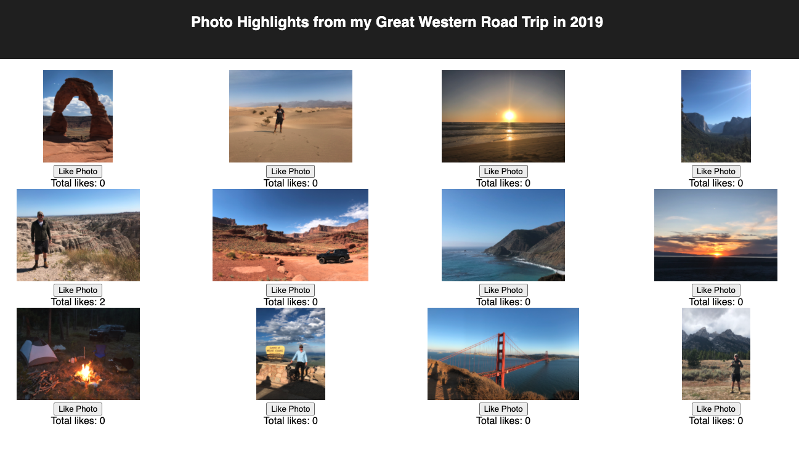

# React Photo Gallery of my Great Western Road Trip of 2019.

## Description

_Duration: 8 hours_

For this project I used React to create a photo gallery of highlights from a road trip I took across the Western United States in 2019.  I made each photo clickable to toggle between photos and descriptions of the photos using conditional rendering.  I also included a 'like' button for each photo with a 'like' count below the button.  In order the get the photos on the page and to count likes I used Axios Get and Put calls.

## Screen Shot

### Prerequisites

- [Node.js](https://nodejs.org/en/)
- Axios
- Nodemon
- Express

## Installation

1. Run `npm install axios express nodemon` in your terminal
2. Run `npm run server` in your terminal 
3. Run `npm run client` in a second terminal
4. The `npm run client` command will open up a new browser tab for you!

## Usage

1. Once the page is up and running view the images.  
2. Click an image toggle to a descption.
3. In order to like an image click a 'like' button.

## Built With
- React
- HTML
- CSS
- Javascript
- Express
- Axios
- Nodemon
- Express

## Acknowledgement
Thanks to [Prime Digital Academy](www.primeacademy.io) who equipped and helped me to make this application a reality. (Thank you to Mary Mosman and Dev Jana for their counsel.)

## Support
If you have suggestions or issues, please email me at [hoffmann1226.com]
